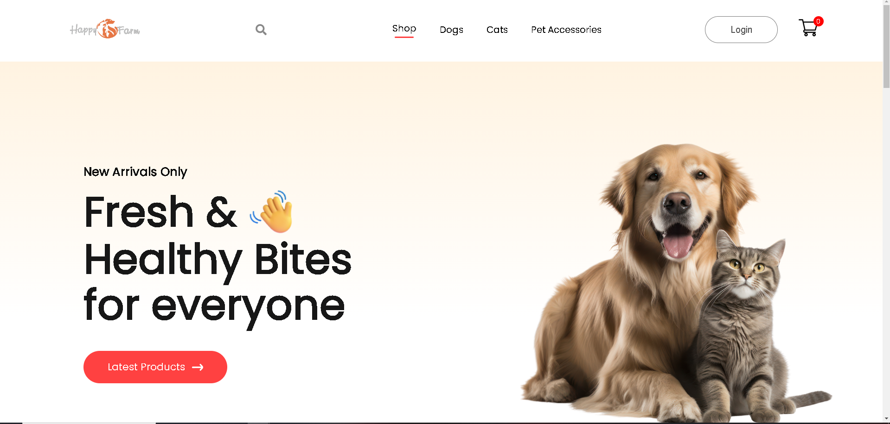
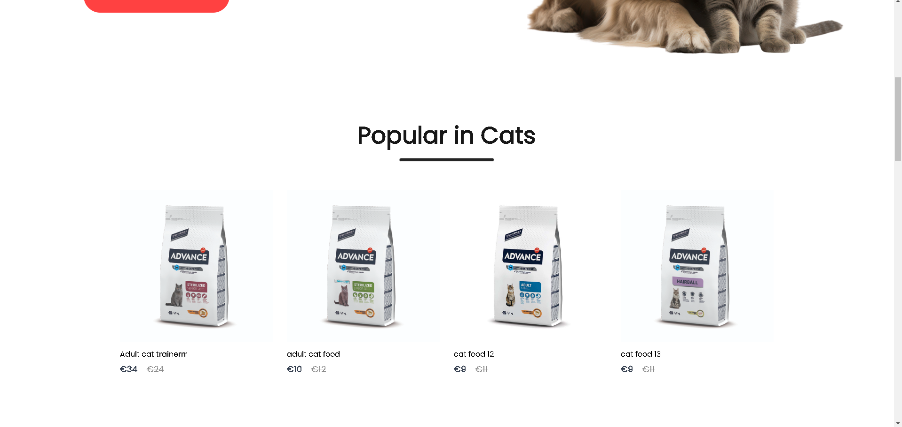
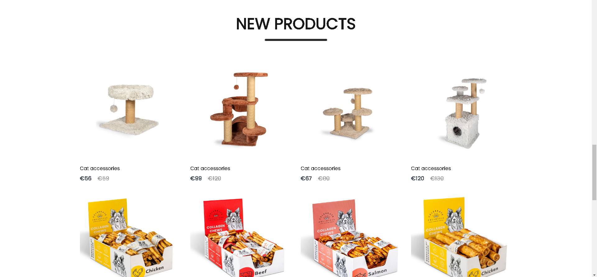
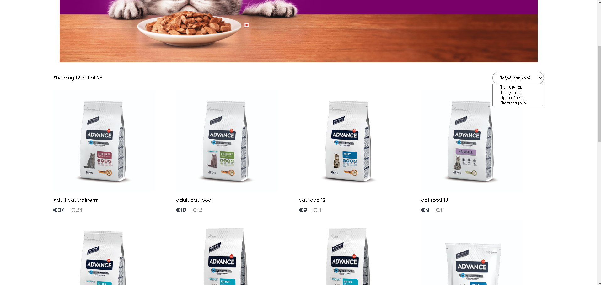
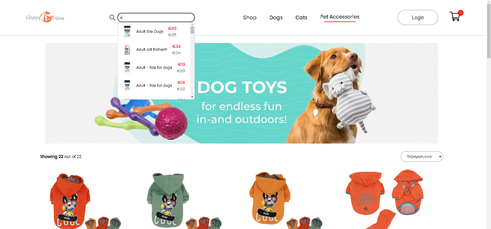
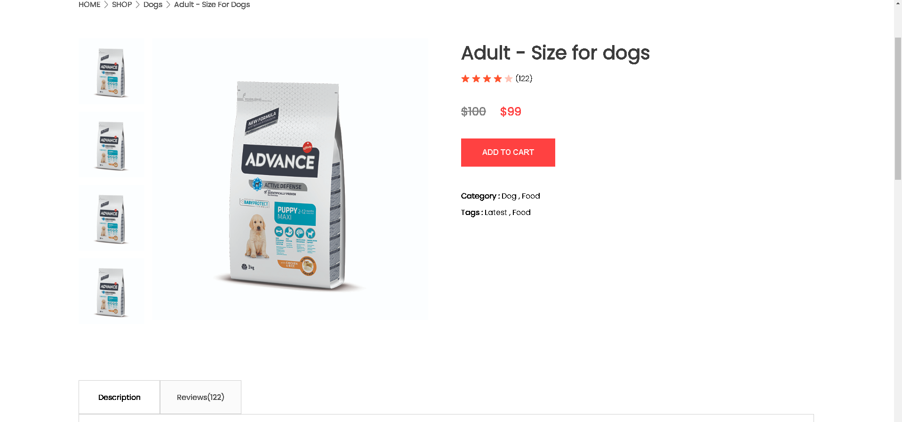
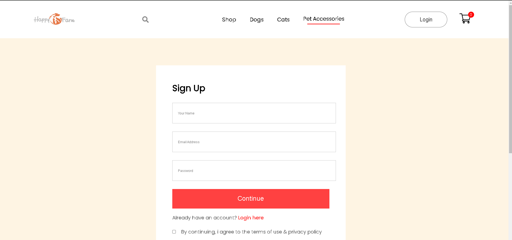
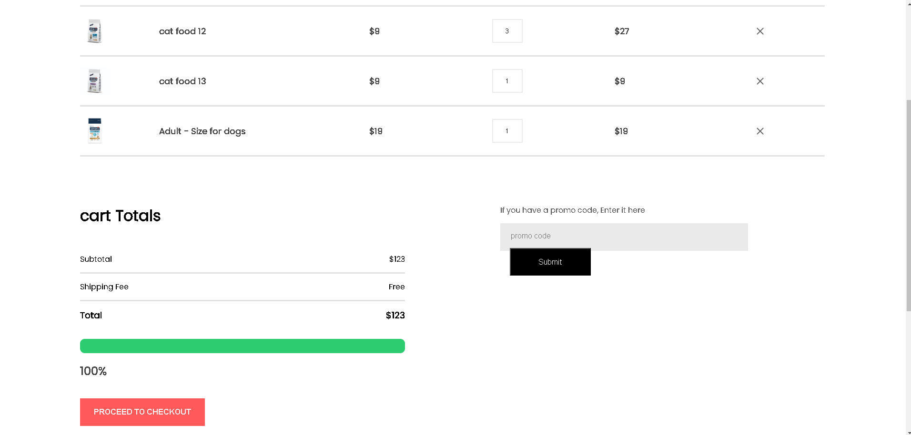
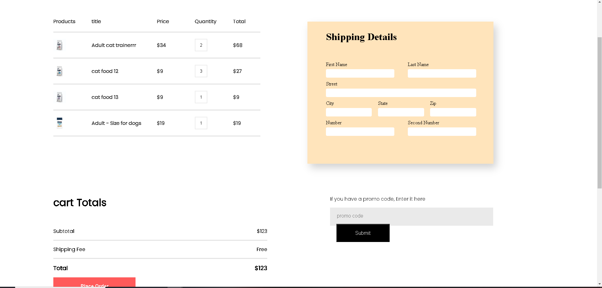
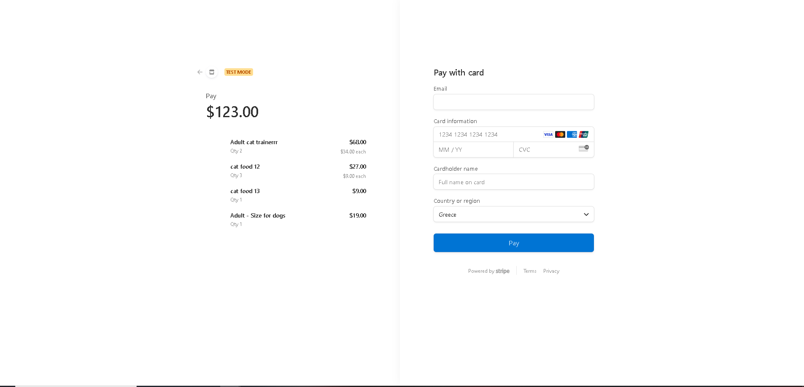

# HappyFarm Shop E-Commerce Site

Welcome to the HappyFarm Shop E-Commerce site! This project is a full-featured online store for pet foods and accessories. Built using React.js, Express, Node.js, MongoDB, and Stripe, this application provides a seamless shopping experience for users.

You can see a video of the app here : 

## Table of Contents

- [Features](#features)
- [Screenshots](#screenshots)
- [Usage](#usage)
- [License](#license)
- [Contact](#contact)

## Features

- **Browse Products**: View the latest products, dog foods, cat foods, and pet accessories.
- **Load More Products**: Dynamically load more products with the "Load More" button.
- **Sort Products**: Sort products by value (highest to lowest, lowest to highest), latest product added, or name.
- **Product Details**: View product details including price, photo, and description.
- **Cart Functionality**: Add products to the cart, view cart contents, and check total amount.
- **Progress Bar**: Visualize the progress towards earning a free gift based on total amount.
- **Checkout Process**: Securely enter shipping details and process payments using Stripe.
- **Payment Confirmation**: Receive a confirmation page upon successful payment.

## Screenshots

## Usage

- **Browse Products**: Use the navigation bar to browse different categories of products and view product details.
- **Add Products to Cart**: Click "Add to Cart" on product pages. You’ll be prompted to log in or create an account if you’re not already logged in.
- **Checkout**: Access the cart page, review your items, and proceed to checkout. Enter your shipping details and use Stripe to complete the payment.
- **Payment Confirmation**: After a successful payment, you’ll be redirected to a confirmation page.

## Contact

For any questions or feedback, please contact:

- **Your Name**: [foxfireninetails9@gmail.com](mailto:foxfireninetails9@gmail.com)
- **GitHub**: [qbeeeeee](https://github.com/qbeeeeee)

Thank you for using HappyFarm Shop! We hope you enjoy your shopping experience. 🐾
